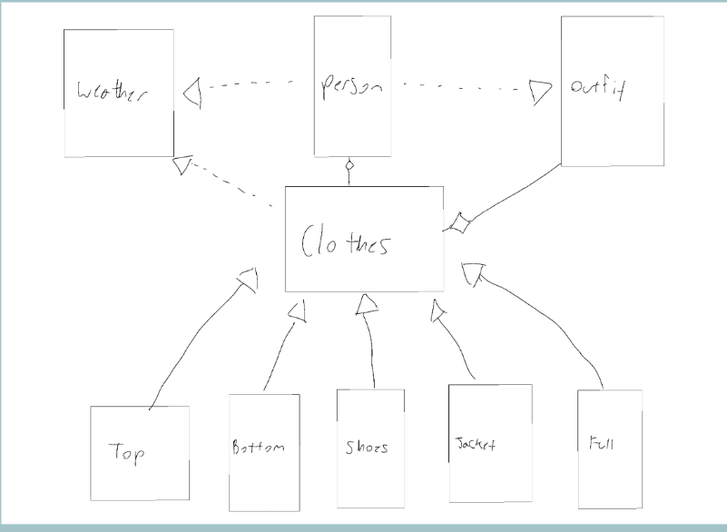

# cs2114-project1-groupNN
Customizable outfit curator based on your own wardrobe. 

# Geared Garment Generator

**CS 2114, Fall 2026 - Cassidy McCahill, Owen Wikel, Sydney Yang**

Geared Garment Generator reads your wardrobe from a CSV file and suggests up to three outfits that match the day's temperature, precipitation, and formality(less than three if you don't have enought clothes for a particular situation).

## How to Run
1. Open the project in Eclipse.
2. Right-click `Main.java` -> Run As -> Java Application.
3. Answer the prompts in the console:
   - Your name
   - Temperature (°F, between -70 and 120)
   - Whether precipitation is expected (yes/no)
   - Formality (casual/formal)
   - Closet file name (e.g., `demo_closet.csv`)

If precipitation is expected, the program sets snow at 32°F or below and rain above 32°F.

## Closet CSV Format
Each row describes one clothing item:
category,warmth,formality,description,jacketType

- **category:** top, bottom, shoes, jacket, or full
- **warmth:** true or false
- **formality:** casual or formal
- **description:** any text
- **jacketType:** rain jacket or winter jacket (jackets only)

Rows with an unrecognized category are skipped and listed after the file is read.

## Included Closet Files
- `demo_closet.csv` - covers every weather and formality combination, plus invalid items
- `sample_closet.csv` - small closet used in tests
- `big_closet.csv` - larger test closet
- `empty_closet.csv` - tests the "not enough clothes" case

## Classes
- **Main:** starts the program
- **Person:** collects user input, reads the CSV, and builds outfits
- **Weather:** stores temperature and precipitation
- **Clothes:** parent class for all clothing items
- **Top, Bottom, Shoes, Full:** clothing subclasses
- **Jacket:** clothing subclass with a jacket type; rain jackets match rain, winter jackets match snow and cold dry days
- **Outfit:** bundles one set of clothing and prints it

## Input Handling
- Invalid temperature, yes/no, or formality -> asks again
- File that can't be opened -> asks for the file name again
- Unrecognized clothing category -> skipped and reported
- Not enough matching clothes -> fewer outfits

## Testing
Each class has a JUnit test class. Console input is simulated in tests so they run automatically. 100% coverage.

## Not Implemented (Stretch Goals)
Photo uploads, weather API, tracking dirty clothes, avoiding repeat outfits by date, planning future events, and color coordination.

## System Diagram

